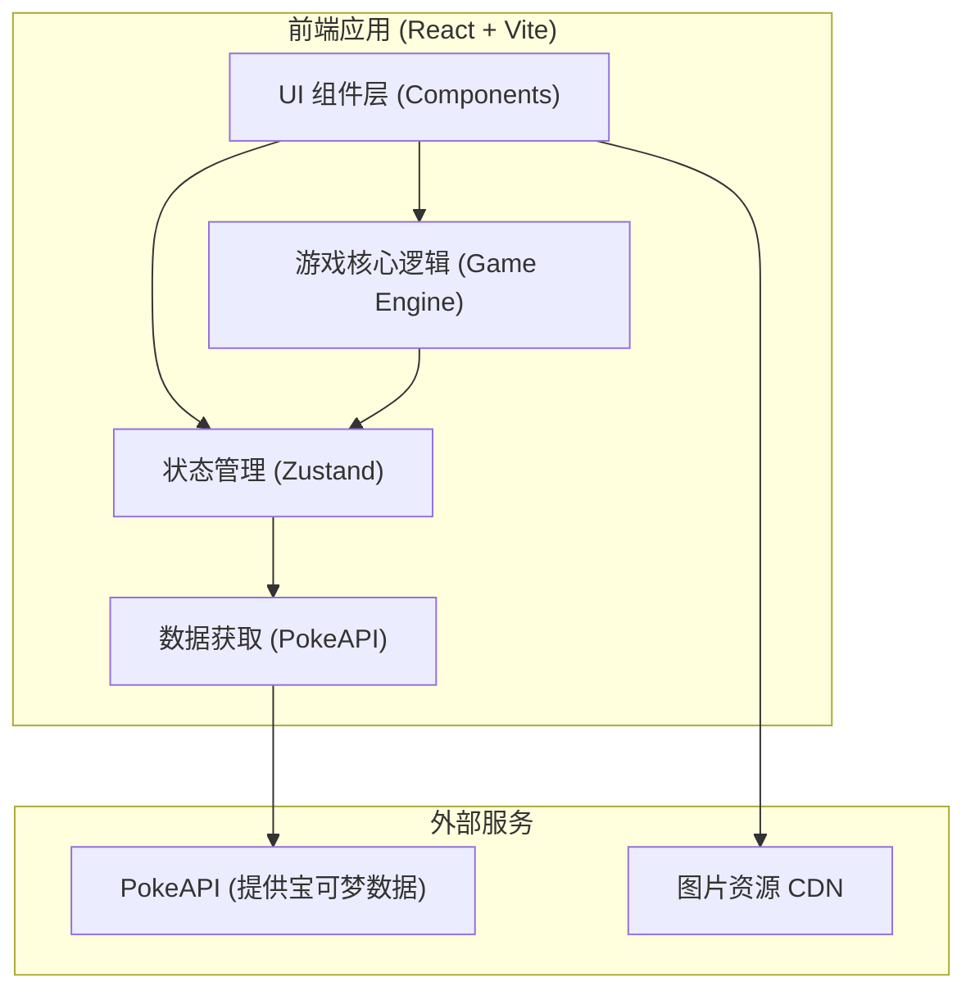

## 1. 架构设计



## 2. 技术栈描述
- **前端框架**：React@18
- **构建工具**：Vite
- **样式方案**：Tailwind CSS@3 + CSS Variables (用于主题色和自定义动画)
- **状态管理**：Zustand (用于管理全局游戏状态：玩家队伍、当前关卡、战斗状态、背包等)
- **动画库**：Framer Motion (用于复杂的 UI 动画，如抽卡翻牌、战斗进出场)
- **数据源**：PokeAPI (`https://pokeapi.co/`) + 预置的精简数据 JSON，避免 API 速率限制。
- **图标与字体**：Lucide React，以及引入具有复古游戏感的字体。

## 3. 路由设计 (或页面状态划分)
考虑到游戏通常是单页面应用 (SPA)，可以通过全局状态来控制当前渲染的 "场景 (Scene)"，而不一定需要真实的 URL 路由。

| 场景/组件 | 功能描述 |
|-------|---------|
| `MainMenu` | 游戏启动屏幕，开始按钮 |
| `MapSelection` | 关卡地图，选择下一场战斗节点 |
| `BattleArena` | 核心战斗界面 |
| `GachaScreen` | 战斗胜利后的抽卡/三选一奖励界面 |
| `TeamManagement`| 队伍阵容调整界面 |
| `GameOver` | 失败结算或通关结算页面 |

## 4. 核心状态定义 (Zustand Store)

```typescript
// 宝可梦实体定义
interface Pokemon {
  id: number;
  name: string;
  types: string[];
  maxHp: number;
  currentHp: number;
  attack: number;
  defense: number;
  speed: number;
  moves: Move[];
  spriteUrl: string;
}

// 技能定义
interface Move {
  name: string;
  type: string;
  power: number;
  accuracy: number;
}

// 游戏全局状态
interface GameState {
  currentScene: 'MainMenu' | 'MapSelection' | 'BattleArena' | 'GachaScreen' | 'TeamManagement' | 'GameOver';
  playerTeam: Pokemon[];
  enemyTeam: Pokemon[];
  currentLevel: number;
  gold: number;
  
  // Actions
  setScene: (scene: GameState['currentScene']) => void;
  addPokemonToTeam: (pokemon: Pokemon) => void;
  healTeam: () => void;
  startBattle: (enemyTeam: Pokemon[]) => void;
}
```

## 5. 数据获取策略
- 为了保证游戏体验的流畅性，游戏启动时会预加载部分常见宝可梦的核心数据（通过内部 JSON 或一次性拉取 PokeAPI 列表）。
- 宝可梦的图片直接使用 PokeAPI 提供的图片 CDN 链接。
- 将设计一个本地的数据映射器，把 PokeAPI 复杂的返回结构精简为游戏所需的 `Pokemon` 接口结构。
