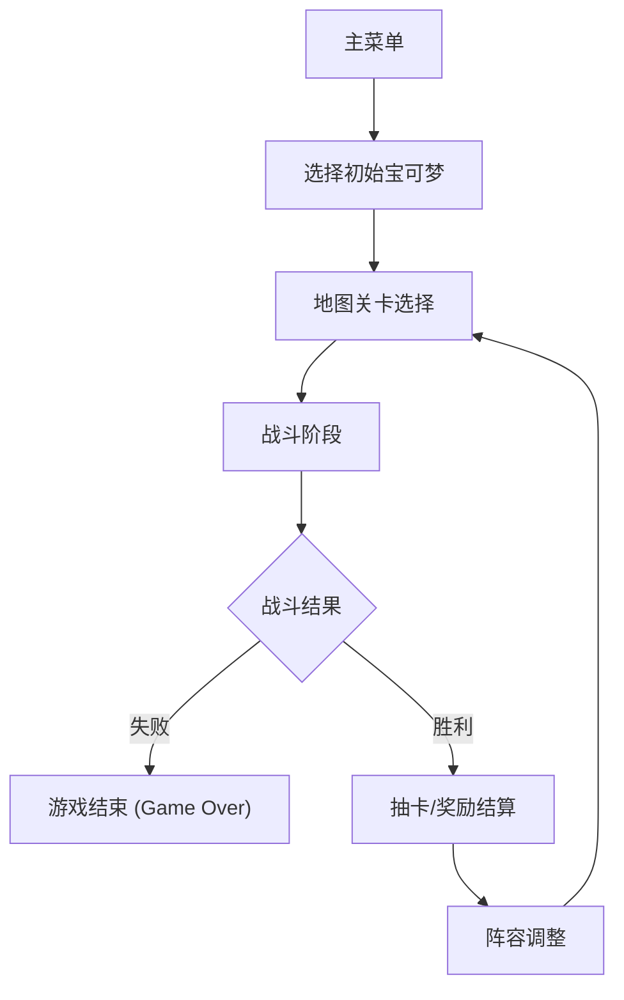

## 1. 产品概述
一款基于网页的宝可梦主题 Roguelike 对战游戏。玩家在随机生成的关卡中与野生宝可梦或训练家对战，每战胜一个关卡后可进行抽卡（获取新的宝可梦或强化道具），自由调整阵容，不断挑战更高难度的关卡。游戏提供完整的宝可梦 UI 界面，带来极具沉浸感和策略性的卡牌对战体验。

- **核心目的**：提供一个快节奏、高随机性的宝可梦对战体验。
- **目标用户**：宝可梦粉丝、Roguelike 游戏爱好者、卡牌构建游戏玩家。
- **产品价值**：将宝可梦的养成与战斗机制与 Roguelike 的随机性和重复游玩价值相结合。

## 2. 核心功能

### 2.1 功能模块
1. **主菜单模块**：开始游戏、查看图鉴。
2. **战斗模块**：回合制对战，包含血条、技能选择、属性克制机制、状态展示。
3. **奖励与抽卡模块**：战斗胜利后进入的抽卡界面（类似杀戮尖塔的战利品三选一，或传统的盲盒抽卡）。
4. **阵容管理模块**：调整上阵队伍（最多6只），查看宝可梦属性和技能。
5. **地图/关卡模块**：展示当前所在的层数或关卡节点，选择下一关的路线。

### 2.2 页面详细说明
| 页面名称 | 模块名称 | 功能描述 |
|-----------|-------------|---------------------|
| 主菜单页 | 开始游戏 | 点击进入第一关，初始化玩家初始阵容。 |
| 地图页 | 节点选择 | 展示树状或线性关卡结构，玩家可选择前进路线（如：普通战斗、精英战斗、休息区）。 |
| 战斗页 | 战斗UI | 敌我双方宝可梦立绘展示，血量/状态条，技能菜单栏，战斗日志提示。 |
| 抽卡页 | 奖励结算 | 胜利后弹出，展示三张背面卡牌或宝可梦球，点击翻开获得新宝可梦或道具。 |
| 阵容页 | 队伍管理 | 拖拽调整上阵顺序，查看详细面板（HP、攻击、防御、技能）。 |

## 3. 核心流程
1. 玩家进入游戏，获得初始宝可梦（如御三家选一）。
2. 进入地图页面，选择下一个关卡。
3. 进入战斗页面，使用回合制指令击败敌人。
4. 战斗胜利，进入抽卡页面获取新宝可梦。
5. 进入阵容页面调整出战顺序。
6. 返回地图页面，继续挑战，直至通关或全部阵亡。

## 4. UI与视觉设计

### 4.1 设计风格
- **整体基调**：致敬经典的宝可梦 UI（GBA/NDS时代）并融合现代扁平化设计，加入像素或高质量立绘元素。
- **色彩规范**：
  - 主色调：精灵球红 (#EE1515)、纯白 (#FFFFFF)
  - 辅色调：图鉴蓝 (#3B4CCA)、黄色 (#FFDE00)
  - 字体色：深灰/纯黑用于高对比度阅读，或者经典游戏字体。
- **UI组件**：卡片式设计，带有圆角和轻微阴影；按钮点击有明确的物理反馈下压效果。
- **动画效果**：
  - 战斗：技能释放特效、受伤闪烁、进出场滑动。
  - 抽卡：卡牌翻转动画（带金色闪光特效代表稀有度）。

### 4.2 页面设计概览
| 页面名称 | 模块名称 | 视觉元素 |
|-----------|-------------|-------------|
| 主菜单页 | 背景与标题 | 动态背景（宝可梦轮播），醒目的 Logo，脉冲动画效果的 Start 按钮。 |
| 战斗页 | 对战面板 | 经典的上下分屏或左右分屏。底部为对话框风格的技能栏。血条采用绿-黄-红变色机制。 |
| 抽卡页 | 抽卡特效 | 黑暗背景聚焦于三张悬浮卡牌，hover 时卡牌浮动放大。 |

### 4.3 响应式设计
- **优先桌面端 (Desktop-first)**：主视图为 16:9 横屏，模拟掌机或主机屏幕体验。
- **移动端适配**：在小屏幕上调整为上下布局，技能按钮变大以适应触屏操作。
